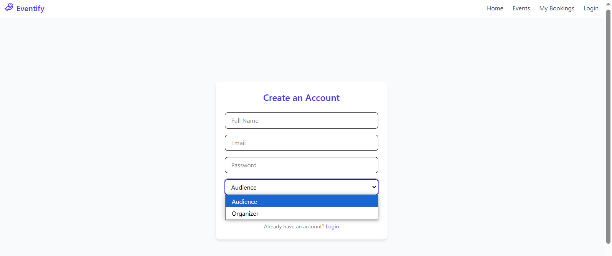

# 🎟️ PERN Stack Event Management App

An event management web application built with the **PERN** stack (**PostgreSQL, Express.js, React, Node.js**) that allows **audiences to browse events and book seats** online.  
Organizer-side event creation interface is **coming soon**!

---

## 🚀 Features

- View available events
- Book seats for events
- Manage and cancel your bookings
- Secure authentication (JWT + Cookies)
- Backend APIs for event listing, booking, and user management
- Built with modular, scalable architecture
- Responsive frontend using **React** and **TailwindCSS**

---

## 📦 Tech Stack

- **Frontend**: React, Vite, TailwindCSS, Axios, Zustand
- **Backend**: Node.js, Express.js
- **Database**: PostgreSQL
- **Authentication**: JWT Tokens (stored in cookies)

---

## Functional Web App Screenshots

### 1. Login Page:


### 2. Signup Page:



### 3. Events Page (for Audiences):

Clicking on any one of the events would lead to the Events Booking Page:


### 4. Event Booking Page (for Audiences):

Before selecting seats:


After selecting seats:


Available seats get updated automatically and booked seats get blocked:


Ticket of this format gets downloaded:


### 5. My Bookings Page:

Allows cancelling a ticket:


---

## 📁 Project Structure

```
PERN-Stack-Event-App/
├── client/         # Frontend (React + Vite)
│   ├── public/
│   └── src/
│       ├── components/
│       ├── pages/
│       ├── store/  # Zustand state management
│       └── utils/
├── server/         # Backend (Express + Node.js)
│   ├── controllers/
│   ├── middlewares/
│   ├── models/
│   ├── routes/
│   └── utils/
├── README.md
├── package.json
└── .env
```

---

## 🛠️ Setup Instructions

### 1. Clone the repository

```bash
git clone https://github.com/SujaiSideshwer/PERN-Stack-Event-App.git
cd PERN-Stack-Event-App
```

### 2. Install dependencies

- For backend:

  ```bash
  cd server
  npm install
  ```

- For frontend:
  ```bash
  cd ../client
  npm install
  ```

### 3. Environment Variables

Create a `.env` file inside the `server` folder and configure:

```env
PORT=5000
DATABASE_URL=your_postgresql_database_url
JWT_SECRET=your_jwt_secret
```

Adjust any other configurations based on your local setup.

### 4. Run the app

- Start backend server:

  ```bash
  cd server
  npm run dev
  ```

- Start frontend client:
  ```bash
  cd ../client
  npm run dev
  ```

Both should be running on separate ports (e.g., frontend on `localhost:5173`, backend on `localhost:5000`).

---

Perfect — adding an **API Endpoints** section will make your README even better for other devs (and for yourself later!).  
Here's a clean list based on a typical event booking backend like yours:

---

## 📚 API Endpoints

> Base URL for backend: `http://localhost:5000/api`

### 🔐 Auth Routes

| Method | Endpoint         | Description                                     |
| :----: | :--------------- | :---------------------------------------------- |
| `POST` | `/auth/register` | Register a new user                             |
| `POST` | `/auth/login`    | Login and receive JWT token                     |
| `GET`  | `/auth/me`       | Get currently logged-in user's info (protected) |
| `POST` | `/auth/logout`   | Logout user (clear cookie)                      |

---

### 📅 Event Routes

| Method | Endpoint      | Description                                         |
| :----: | :------------ | :-------------------------------------------------- |
| `GET`  | `/events`     | Get all available events                            |
| `GET`  | `/events/:id` | Get details of a specific event                     |
| `POST` | `/events`     | Create a new event _(Organizer only — coming soon)_ |

---

### 🎟️ Booking Routes

|  Method  | Endpoint               | Description                                         |
| :------: | :--------------------- | :-------------------------------------------------- |
|  `POST`  | `/bookings/:eventId`   | Book a seat for an event (protected)                |
|  `GET`   | `/bookings/my`         | Get all bookings for the logged-in user (protected) |
| `DELETE` | `/bookings/:bookingId` | Cancel a booking (protected)                        |

---

### ⚙️ Middleware

- Most routes that modify data require authentication via **JWT cookie**.
- Use `Authorization: Bearer <token>` header if needed for API testing.

---

## 📋 Upcoming Features

- 🎤 **Organizer Dashboard** to create and manage events
- 📄 **Ticket Download** after booking (PDF)
- 🛒 **Online Payments Integration**
- 🖼️ **Event Cover Images and Details**
- 📈 **Analytics** for organizers
- 🔔 **Email Notifications** for bookings and cancellations

---

## 🤝 Contributing

Contributions, issues, and feature requests are welcome!  
Feel free to open a pull request or submit an issue.

---

## 📄 License

This project is licensed under the [MIT License](LICENSE).

---

## 🙌 Acknowledgements

Thanks to all open-source packages and the awesome dev community! 🚀
